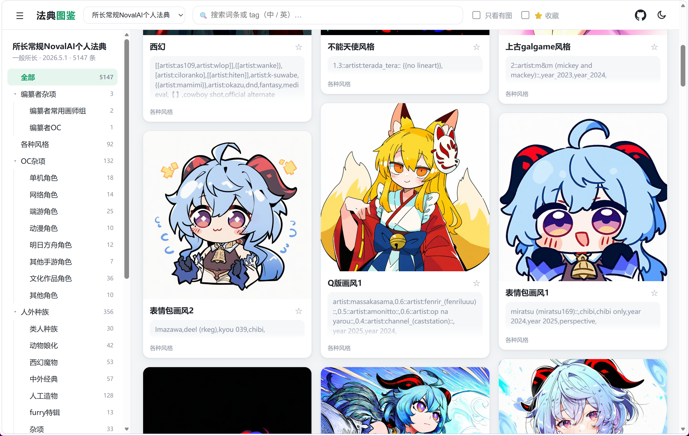

# 法典图鉴 · NovelAI 提示词图鉴

[示例站点](https://novelai-tag.pages.dev/)

把社区大佬整理的 NovelAI 提示词「法典」做成 **图为主、点一下就复制** 的网页图鉴。
定位：**忠实复刻**这些法典，让萌新和休闲用户照着例图选词、一键复制到 NovelAI——而不是又一个 tag 商店。

## ✨ 特性
- 🖼️ **图为主瀑布流**：照图选词，看对眼了点一下就复制整条 prompt
- 📋 **整卡点击复制** + ✓ 提示，复制即用
- 🗂️ **法典 / 目录导航**：顶部切换法典，左侧目录树自动跟随，完整保留作者原结构
- 🆕 **新增角标**：自动识别法典里高亮标记的「本次更新新增」
- 🔍 **中英实时搜索**、🌙 **深色模式**、📱 响应式、点图放大
- 🧩 **零构建静态站**：纯 HTML/CSS/JS，可直接部署到 GitHub Pages / Cloudflare Pages
- 🛠️ **配套工具**：docx 一键转换器 + 本地拖拽配图工具，**全程不用写代码**

## 🌐 在线访问
> 部署完成后把网址填到这里：`https://<your-project>.pages.dev`

## 🚀 本地使用（Windows 双击即用）
> 前置：本机装好 Python 3，并 `pip install -r requirements.txt`

1. **加法典**：把法典 `.docx` 放进 `法典源/` → 双击 `转换法典.bat`
2. **配图**：双击 `配图工具.bat` → 把图拖到对应词条上（自动压缩、命名、入库）
3. **预览**：双击 `启动预览.bat` → 打开 http://localhost:8766

转换器还会生成 `site/data/待复核_*.txt`，列出极少数可能解析有误的词条，供人工复核。

## ☁️ 部署上线
静态站，无需构建：
- **Cloudflare Pages**（推荐，国内更稳）：连接本仓库，Build command 留空，**Build output directory 填 `site`**
- **GitHub Pages**：把 Pages 源指向 `site/` 目录

更新流程：本地配图 / 加法典 → 双击 `发布.bat`（git push）→ 平台自动重新部署，约 1 分钟生效。
数据与图片都存在本仓库（GitHub）里，平台只是拉取并展示。

## 📁 目录结构
```
法典源/            法典 .docx 源文件
tools/
  convert.py       docx -> 网站数据(JSON)
  imgserver.py     本地配图服务
  pei.html         配图工具界面
site/              ← 部署的网站本体（无需构建）
  index.html
  assets/          样式与脚本
  data/            各法典 JSON + 法典索引
  images/<法典id>/ 例图（按词条 id 命名）
转换法典.bat / 配图工具.bat / 启动预览.bat / 发布.bat
```

## 🗺️ 后续计划（Roadmap）

### A. 早晚要做
- [ ] 处理「待复核」里的异类段落：`各式场景 › 视角与打光` 是「术语：解释」的词典式内容、`自然语言` 是整段中文描述，需单独渲染或排除（目前唯一的小瑕疵）
- [ ] 导入其余几本法典（把 docx 丢进 `法典源/` 跑转换器即可）
- [ ] 图片量大后迁移到 **Cloudflare R2**（免费出站、容量近乎无限；接近 GitHub ~1GB 或 CF Pages 2 万文件上限前再做）

### B. 锦上添花
- [x] 网站图标 favicon
- [x] 词条收藏（⭐，浏览器本地记忆）
- [ ] 缩略图尺寸调优（已保留原图，可重压更小以加速加载、减小仓库）
- [ ] 点击放大查看原图（随 R2 一起做）
- [ ] README 配真实界面截图
- [ ] （可选）tag 购物车 / 权重快捷按钮（偏 prompt 编辑器，与「忠实复刻」定位略有取舍）

### C. 持续进行
- [ ] **配图**：为更多词条补充例图——这是「图为主」体验的核心内容工作

### D. 社区共建（群友提议 · 远期设想）
> 这两项需要后端 / 校验逻辑，超出当前「纯静态站」范畴，属较大方向，先记录设想。

- [ ] **用户投稿**：开放一个投稿站点（可单独建仓库 / 部署），让大家给词条贡献例图——上传图片并指定对应词条，后端**先校验 tag**（确认与某词条匹配）再接收；不匹配则提示「疑似误传」等，通过后自动转存到指定存储（服务器 / GitHub / Cloudflare）。投稿站同样内置一键复制 tag。目的：把「配图」从一人扛变成众人拾柴。
- [ ] **画风串分享**：新增模块，供大家**自愿上传、分享自己常用的「画风串」**（画师 tag + 权重的组合配方），形成社区共建的画风库，方便互相取用。

## 🙏 说明与致谢
- 法典 tag 内容版权归各位**原整理者**所有；本项目只提供更好的浏览/复制体验，忠实呈现其成果。
- 瀑布流界面参考了 [orilights/PixivCollection](https://github.com/orilights/PixivCollection)。
- 代码部分可自由使用、修改。
